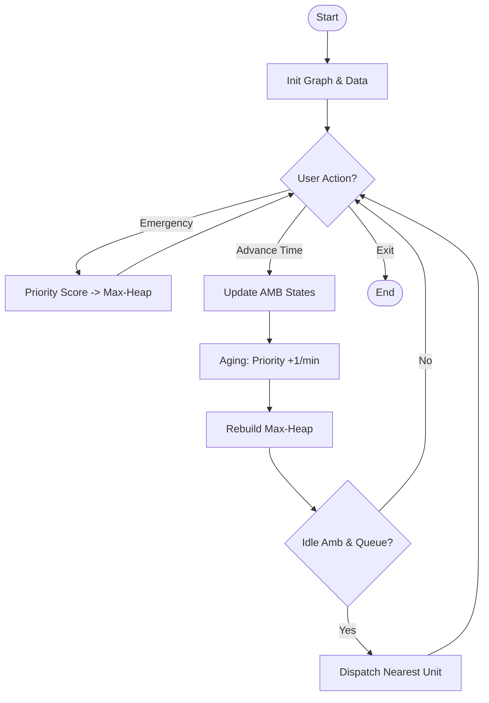

# SEE Exam Guide: Ambulance Dispatch System (`ambulance.c`)

This document serves as a comprehensive technical guide and writeup for the Ambulance Dispatch System. It covers the problem statement, data structure choices, algorithmic implementation, and system logic.

---

## 1. Problem Statement
The goal is to design an automated Emergency Medical Response system that:
-   **Minimizes response time** using graph-based pathfinding.
-   **Optimizes hospital selection** based on medical specialty and distance.
-   **Ensures fairness** in patient prioritization using an aging-enabled priority queue.
-   **Synchronizes** with a real-time web dashboard for telemetry.

---

## 2. Technical Roadmap (Steps & Data Structures)

### A. Data Structures: Implementation vs. Theory
| Project Feature | Implementation Name | DSA Concept | Why this choice? |
| :--- | :--- | :--- | :--- |
| **City Graph** | `Road* roads[10]` | **Adjacency List** | Memory efficient ($O(V+E)$) for sparse city networks compared to matrices ($O(V^2)$). |
| **Emergency Queue** | `pendingQueue[20]` | **Max-Heap** | Enables $O(\log N)$ insertion and $O(1)$ access to the most critical patient. |
| **Fleet Storage** | `ambulances[5]` | **Static Array** | Contiguous memory allocation allows $O(1)$ random access by Unit ID. |
| **Hospital Registry** | `hospitals[5]` | **Array of Structs** | Simplifies linear searching for specialties and capacity checks. |
| **Pathfinding State** | `distance[10]` | **Priority Array** | Used by Dijkstra to track the shortest known path during execution. |

### B. Struct Definitions (The Data Layer)
```c
// Linked List node for Adjacency List
typedef struct Road {
    int destination;
    int distance;
    struct Road* next;
} Road;

// Data container for Emergency telemetry
typedef struct {
    int id;
    int basePriority;
    int priority;    // Dynamic (Base + WaitTime)
    int reportTime;
    CriticalityLevel criticality;
} Emergency;
```

### C. Execution Pipeline
1.  **Bootstrapping**: Build the graph using `malloc` to link locations.
2.  **Telemetry Ingest**: Capture name, age, symptoms, and **Criticality Level**.
3.  **Heuristic Scoring**: Calculate `basePriority` using specialized weights.
4.  **Aging Pulse**: Every `advanceTime` step, update the `priority` score of waiting patients (+1 point/min).
5.  **Heap Maintenance**: Perform a **Bottom-Up Rebuild** of the Max-Heap after every aging pulse ($O(N)$ vs $O(N \log N)$).
6.  **Optimal Match**: Find the `IDLE` ambulance with the shortest Dijkstra distance to the patient.

---

## 3. Algorithmic Deep Dive

### A. Dijkstra's Algorithm (Path Optimization)
-   **Purpose**: Finds the minimal distance path in the weighted graph.
$- **Process**:
    1. Initialize `distance[all] = infinity`, `distance[source] = 0`.
    2. Pick the unvisited node with the smallest distance.
    3. Update neighbors: `newDist = dist[u] + weight(u,v)`.
    4. Repeat until all nodes are visited bits.
-   **Complexity**: $O(V^2)$ with arrays, $O(E \log V)$ with priority queues.

### B. Max-Heap Operations (Priority Management)
-   **Insertion (`enqueue`)**: Places the new element at the leaf and performs **HeapifyUp** ($O(\log N)$).
-   **Extraction (`dequeue`)**: Replaces the root with the last leaf and performs **HeapifyDown** ($O(\log N)$).
-   **Refresh (`Aging`)**: Updates all scores in place and calls `buildHeap` (iterative `heapifyDown` from `size/2` down to `0`).

### C. Heuristic Selection (Hospital Matching)
The system uses a weighted score to favor specialized care over mere proximity:
`TotalScore = (Distance * 10) - (SpecialtyBonus if match else 0)`
- **Specialty Bonus**: 50 points (equivalent to saving 5km of travel).

---

## 4. Discussion: Starvation & Fairness

### The "Starvation" Problem
In standard priority queues, a "Low Priority" patient (e.g., General Infection) could wait indefinitely if a stream of "Critical" patients (e.g., Cardiac Arrest) keeps arriving.

### The Solution: Aging
By incorporating time into the priority formula:
`Priority = (BaseWeight) + (WaitTime * WAIT_TIME_WEIGHT)`
...the "Low Priority" patient's score eventually surpasses new "High Priority" arrivals, guaranteeing service.

---

## 5. Visual Flowchart (Conceptual Logic)


---

## 6. Exam Tips for Writeup
-   **Complexity**: Mention $O(V^2)$ for Dijkstra if asked about scalability.
-   **Heap Property**: State that a Max-Heap is a **Complete Binary Tree** where Parent $\geq$ Child.
-   **Adjacency List**: Explain it's an array of pointers to linked lists, saving memory when nodes aren't fully connected.
